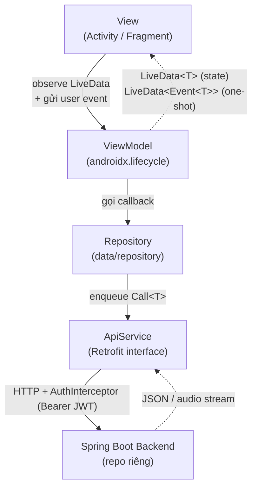
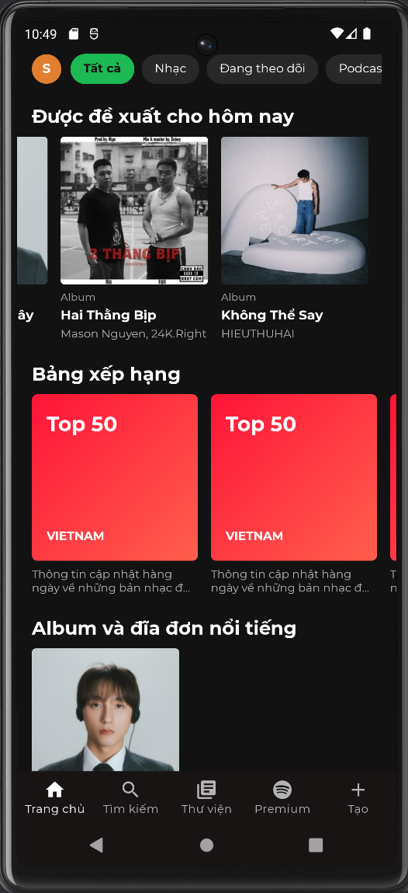
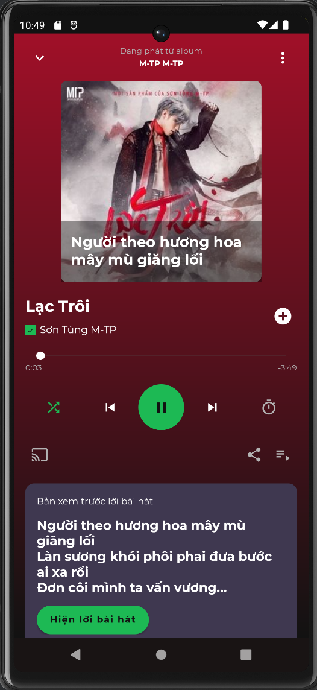
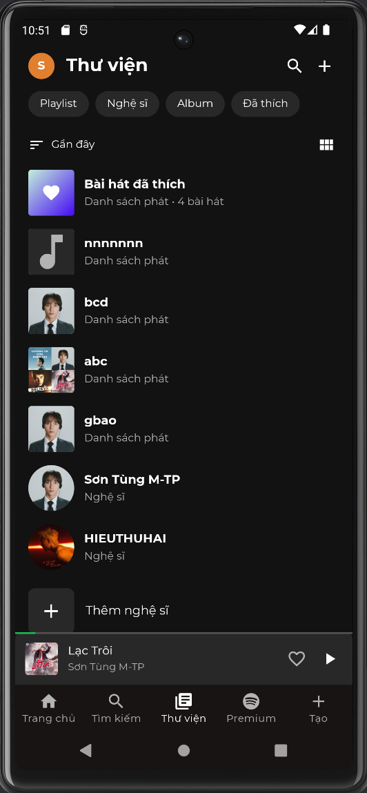
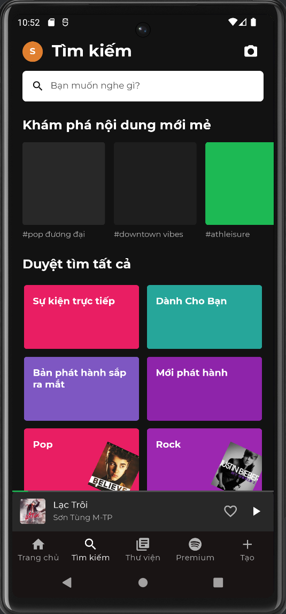
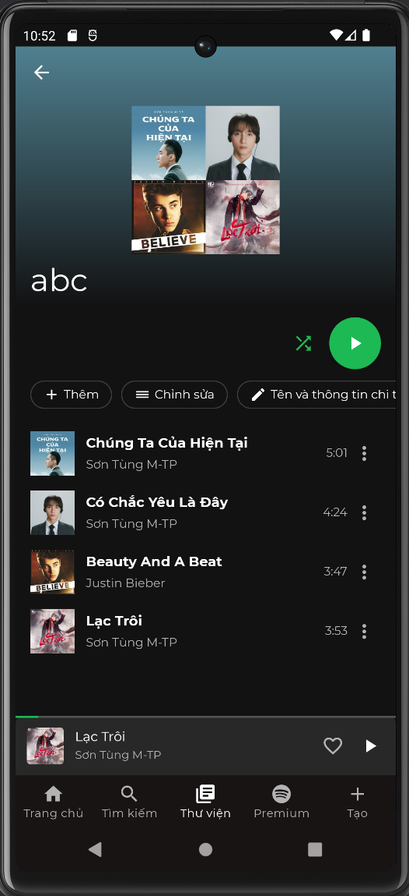
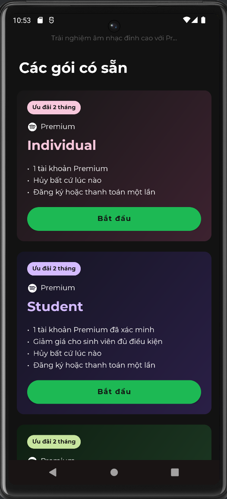
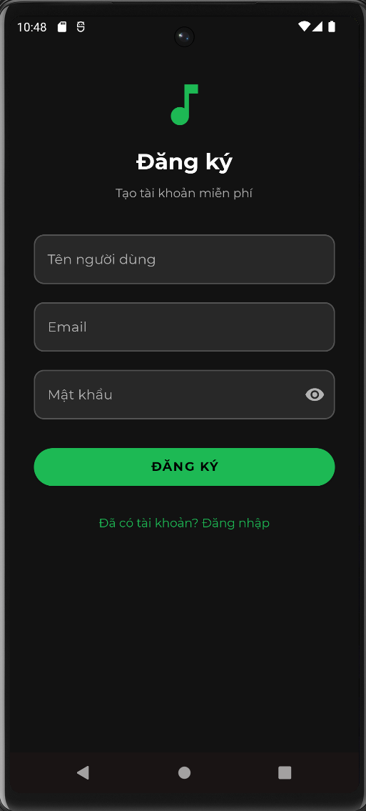

# 🎵 Music Streaming App — Android Client

> Ứng dụng **Android native (Java)** nghe nhạc trực tuyến theo phong cách Spotify, dành cho người dùng Việt Nam. Đây là **client Android** của một hệ thống full-stack — phần backend Spring Boot nằm ở repo riêng.

<p align="center">
  
  
  
  
  
  
  
  
</p>

---

## 📖 Về dự án

**Music Streaming App** là một **ứng dụng Android native viết bằng Java**, không phải web frontend. Nó đóng vai trò là **client** trong một hệ thống nghe nhạc trực tuyến tách thành 2 repository độc lập:

| Thành phần | Công nghệ | Repository |
|------------|-----------|------------|
| 📱 **Android App** (repo này) | Java · MVVM · Retrofit · ExoPlayer | bạn đang ở đây |
| 🖥️ **Backend API** | Spring Boot · MySQL · Spring Security (JWT) · File Streaming | [Online_music_streaming_app_BE](https://github.com/HoangGiaBaoo/Online_music_streaming_app_BE) |

> ℹ️ Tên repository có hậu tố `-FE` để phân biệt với backend, nhưng **đây là ứng dụng Android native**, giao tiếp với backend qua REST API (Retrofit) và stream audio qua HTTP Range (ExoPlayer).

App được build theo kiến trúc **MVVM** với **ViewBinding**, dependency injection thủ công (không dùng Hilt), giao tiếp backend qua Retrofit và phát nhạc bằng Media3 ExoPlayer. Toàn bộ luồng nghiệp vụ — đăng nhập đa tài khoản, home feed nhiều section, quản lý thư viện, phát nhạc nền với mini-player, gói Premium kèm thanh toán VNPay — đều được hiện thực hóa trên thiết bị Android.

---

## ✨ Tính năng chính

- 🔐 **Xác thực & đa tài khoản** — Đăng ký / đăng nhập JWT, thêm và chuyển đổi nhanh giữa nhiều tài khoản.
- 🏠 **Home feed nhiều section** — Featured, top picks, nghe gần đây, gợi ý, bảng xếp hạng, playlist theo mood, phát hành mới, nghệ sĩ nổi bật.
- 🔎 **Tìm kiếm** — Tìm bài hát và nghệ sĩ; màn khám phá thể loại dạng lưới khi chưa nhập từ khóa.
- 📚 **Thư viện cá nhân** — Playlist, bài hát đã thích, nghệ sĩ đang theo dõi với 4 bộ lọc chip.
- 🎧 **Trình phát nhạc đầy đủ** — ExoPlayer streaming (HTTP Range), seek bar, prev/next, **mini-player** xuyên suốt màn hình, gradient nền lấy màu chủ đạo từ ảnh bìa (Palette), **lời bài hát đồng bộ LRC**.
- 🎵 **Quản lý playlist** — Tạo / sửa / xóa, upload ảnh bìa, public/private, **thêm bài, xóa bài và kéo–thả sắp xếp lại thứ tự**.
- 🖼️ **Ảnh bìa playlist tự sinh** — Ghép lưới 2×2 từ 4 bài đầu khi playlist chưa có ảnh bìa.
- 💎 **Premium** — Các gói (Individual / Student / Family), **thanh toán VNPay qua WebView**, quảng cáo **AdMob** (banner + interstitial) cho người dùng Free, và **premium gate** chặn tính năng cao cấp (chất lượng cao, tắt trộn bài).
- 👤 **Hồ sơ & thống kê** — Xem/sửa hồ sơ, upload avatar, thống kê nghe nhạc (top nghệ sĩ/bài hát theo tuần/tháng/năm), trang cài đặt.
- 🎨 **Trải nghiệm UI** — Theme tối kiểu Spotify, font Montserrat, shimmer skeleton khi tải, hiệu ứng chuyển màn mượt.

---

## 🛠️ Tech stack

> Phiên bản lấy chính xác từ `app/build.gradle.kts` và `gradle/libs.versions.toml`.

### Nền tảng

| Hạng mục | Giá trị |
|----------|---------|
| Ngôn ngữ | Java 11 |
| minSdk / targetSdk / compileSdk | **24** / **36** / **36** |
| Build system | Gradle (Kotlin DSL) · AGP 9.0.1 |
| UI binding | ViewBinding |

### Thư viện

| Thư viện | Phiên bản | Mục đích |
|----------|-----------|----------|
| Retrofit + Converter Gson | `2.9.0` | HTTP client gọi REST API |
| OkHttp Logging Interceptor | `4.12.0` | Log request/response + gắn Bearer token |
| Media3 ExoPlayer (`exoplayer` + `ui`) | `1.3.1` | Stream & phát audio (hỗ trợ HTTP Range) |
| Glide + glide-transformations | `4.16.0` / `4.3.0` | Tải & biến đổi ảnh (bo góc, blur) |
| AndroidX Lifecycle (ViewModel · LiveData · Runtime) | `2.8.7` | Tầng MVVM |
| Material Components | `1.13.0` | Material 3 UI |
| AndroidX Fragment | `1.8.4` | Fragment + shared ViewModel |
| ViewPager2 | `1.1.0` | Pager cho các subtab thư viện |
| AndroidX Palette | `1.0.0` | Trích màu chủ đạo từ ảnh bìa |
| Facebook Shimmer | `0.5.0` | Loading skeleton |
| CircleImageView | `3.1.0` | Avatar bo tròn |
| Google Mobile Ads (AdMob) | `23.0.0` | Banner + interstitial (test IDs) |
| AppCompat · ConstraintLayout · Activity | `1.7.1` · `2.2.1` · `1.13.0` | AndroidX core UI |
| JUnit · AndroidX Test ext · Espresso | `4.13.2` · `1.3.0` · `3.7.0` | Testing |

---

## 🏗️ Kiến trúc — MVVM

App tuân thủ nghiêm ngặt mô hình **MVVM** một chiều: View chỉ quan sát `LiveData` và bind sự kiện, không bao giờ gọi thẳng Retrofit hay giữ state nghiệp vụ.



**Nguyên tắc cốt lõi:**

1. **View** (Activity/Fragment) chỉ lo lifecycle + bind View ↔ ViewModel.
2. **ViewModel** sống qua config change, expose `LiveData<T>` (state) và `LiveData<Event<T>>` (snackbar/navigate one-shot).
3. **Repository** bọc Retrofit thành callback đơn giản (`RepoCallback<T>`), không phụ thuộc lifecycle.
4. **Không Hilt** — `VmFactory` là factory thủ công duy nhất cho mọi ViewModel.
5. **Không coroutines/RxJava** — Retrofit `enqueue` + `MutableLiveData.postValue` là đủ.

### Cấu trúc package & quy mô

```
com.example.musicstreamingapp/
├── MusicApp.java           # Application class — init AdMob + đếm bài cho interstitial
├── *Activity.java          # 22 Activity (Splash, Login, Main, Player, các Detail…)
├── adapter/                # 32 RecyclerView adapter
├── data/
│   ├── Resource.java       # wrapper Loading | Success | Error
│   ├── Event.java          # SingleLiveEvent one-shot
│   ├── RepoCallback.java   # interface onSuccess / onError
│   └── repository/         # 7 Repository
├── fragment/               # 20 Fragment + BottomSheet
├── model/                  # 25 POJO/DTO (khớp 1-1 với DTO backend)
├── network/                # ApiService (57 endpoint) + RetrofitClient + AuthInterceptor
├── ui/                     # PlaylistCoverView (custom view)
├── util/                   # 12 util (PlayerManager, AdManager, NavHelper, TokenManager…)
└── viewmodel/              # 24 ViewModel + VmFactory
```

| Thành phần | Số lượng |
|------------|---------:|
| Activity | 22 |
| Fragment (gồm BottomSheet) | 20 |
| ViewModel | 24 |
| Repository | 7 |
| RecyclerView Adapter | 32 |
| Model / DTO | 25 |
| Layout XML (`res/layout/`) | 90 |
| REST endpoint (`ApiService`) | 57 |

> 📄 Muốn đào sâu kiến trúc, từng class, từng luồng nghiệp vụ → xem **[`FRONTEND_OVERVIEW.md`](FRONTEND_OVERVIEW.md)**.

### Các màn hình chính

| Nhóm | Màn hình |
|------|----------|
| **Khởi động & Auth** | `SplashActivity` · `LoginActivity` · `RegisterActivity` · `AddAccountActivity` |
| **Trung tâm** | `MainActivity` (5 tab: Trang chủ · Tìm kiếm · Thư viện · Premium · Tạo) |
| **Phát nhạc** | `PlayerActivity` · `LyricsActivity` |
| **Chi tiết** | `AlbumDetailActivity` · `ArtistDetailActivity` · `PlaylistDetailActivity` · `GenreDetailActivity` · `RecentActivity` · `LikedSongsActivity` |
| **Quản lý playlist** | `EditPlaylistActivity` · `PlaylistCoverPickerActivity` |
| **Premium** | `PremiumPlansActivity` · `PaymentActivity` (VNPay WebView) |
| **Tài khoản** | `ProfileActivity` · `EditProfileActivity` · `ListeningStatsActivity` · `SettingsActivity` |

---

## 🚀 Cài đặt & chạy

### Yêu cầu

- **Android Studio** (Ladybug trở lên khuyến nghị) với Android SDK 36
- **JDK 11+**
- Thiết bị/emulator chạy **Android 7.0 (API 24)** trở lên
- **Backend Spring Boot** đang chạy — xem [repo backend](https://github.com/HoangGiaBaoo/Online_music_streaming_app_BE)

### Các bước

**1. Clone repository**

```bash
git clone https://github.com/HoangGiaBaoo/Music-Streaming-App-FE.git
cd Music-Streaming-App-FE
```

**2. Mở bằng Android Studio**

`File → Open…` → chọn thư mục vừa clone → đợi Gradle sync hoàn tất.

**3. Khởi động backend**

Clone và chạy [Online_music_streaming_app_BE](https://github.com/HoangGiaBaoo/Online_music_streaming_app_BE) — backend lắng nghe ở `http://localhost:8080/musicapp/`.

**4. Cấu hình Base URL**

App trỏ tới backend qua hằng số trong `app/src/main/java/com/example/musicstreamingapp/network/RetrofitClient.java`:

```java
public static final String BASE_URL       = "http://10.0.2.2:8080/musicapp/";
public static final String BASE_MEDIA_URL = "http://10.0.2.2:8080/musicapp";
```

| Môi trường chạy | Giá trị Base URL |
|-----------------|------------------|
| 🤖 **Emulator** (mặc định) | `http://10.0.2.2:8080/musicapp/` — `10.0.2.2` là alias trỏ về `localhost` của máy host |
| 📱 **Thiết bị thật** (cùng mạng LAN) | `http://<IP_LAN_CỦA_MÁY>:8080/musicapp/` — ví dụ `http://192.168.1.10:8080/musicapp/` |

> 💡 Khi đổi sang thiết bị thật, sửa cả hai hằng số ở trên, đảm bảo điện thoại và máy chạy backend **cùng một mạng Wi-Fi**.

**5. Build & Run**

Chọn thiết bị/emulator rồi nhấn **Run ▶** (hoặc `Shift + F10`). App sẽ build và cài đặt tự động.

```bash
# hoặc build từ dòng lệnh
./gradlew assembleDebug
```

> ⚠️ Nếu Android Studio báo lỗi giả kiểu *"Cannot resolve method"* trên các lệnh ViewBinding (`*.getRoot()`) dù Gradle build sạch, hãy chạy **Build → Rebuild Project** hoặc **Sync Project with Gradle Files**.

---

## 📸 Screenshots

<table align="center">
  <tr>
    <td align="center">
      <br/>
      <sub><b>🏠 Trang chủ</b><br/>Home feed nhiều section</sub>
    </td>
    <td align="center">
      <br/>
      <sub><b>🎧 Trình phát nhạc</b><br/>Gradient + xem trước lời bài hát</sub>
    </td>
    <td align="center">
      <br/>
      <sub><b>📚 Thư viện</b><br/>Playlist · Nghệ sĩ · Album · Đã thích</sub>
    </td>
  </tr>
  <tr>
    <td align="center">
      <br/>
      <sub><b>🔎 Tìm kiếm</b><br/>Khám phá thể loại dạng lưới</sub>
    </td>
    <td align="center">
      <br/>
      <sub><b>🎵 Chi tiết playlist</b><br/>Ảnh bìa ghép 2×2 tự sinh</sub>
    </td>
    <td align="center">
      <br/>
      <sub><b>💎 Premium</b><br/>Các gói Individual · Student · Family</sub>
    </td>
  </tr>
  <tr>
    <td align="center">
      <br/>
      <sub><b>🔐 Đăng ký / Đăng nhập</b><br/>Xác thực JWT</sub>
    </td>
    <td></td>
    <td></td>
  </tr>
</table>

---

## 🔗 Liên kết

- 🖥️ **Backend (Spring Boot):** [github.com/HoangGiaBaoo/Online_music_streaming_app_BE](https://github.com/HoangGiaBaoo/Online_music_streaming_app_BE)
- 📄 **Tài liệu kiến trúc chi tiết:** [`FRONTEND_OVERVIEW.md`](FRONTEND_OVERVIEW.md)

---

<p align="center">
  <sub>Ứng dụng Android native (Java) · Kiến trúc MVVM · Một nửa client của hệ thống full-stack Music Streaming.</sub>
</p>
